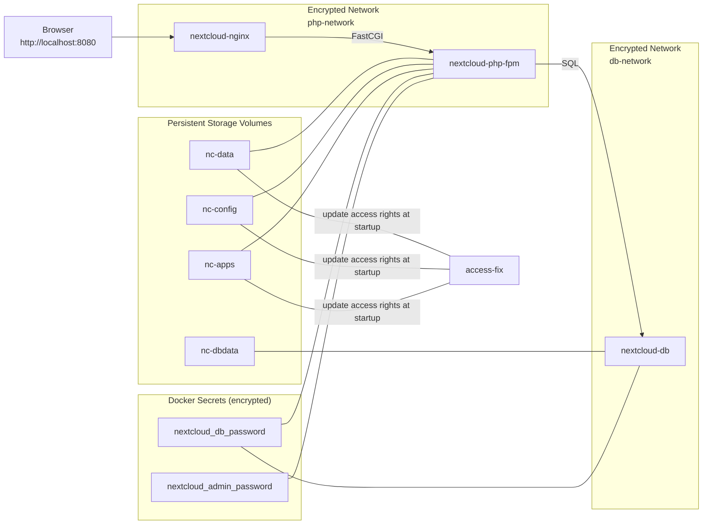

# Minimalistic Secure Nextcloud Docker Images

Lean, hardened Nextcloud stack with two images:

- [mwaeckerlin/nextcloud-nginx]: NGINX Nextcloud frontend in only ??MB
- [mwaeckerlin/nextcloud]: PHP‑FPM Nextcloud backend in only ??MB

This splitting is in accordance to Docker philosophy of having only one server process per image and to NGINX which splits PHP processing into a separate service. It therefore also follows strong microservice architecture.

Both together are the most lean and secure images for Nextcloud:
 - extremely small size, minimalistic dependencies
 - no shell, only the server command
 - small attack surface
 - starts as non-root user
 - configuration and secrets hidden in the backend service only
 - all PHP files are empty stubs in the NGINX frontend
 - passwords never in environment variables, delivered as Docker secrets

??MB is mostly the size of the Nextcloud distribution itself, stored in both images.

Compared to the official [nextcloud] image, this package has:
 - Less attack surface.
 - Better encapsulation.
 - Running as non-privileged user.
 - Much smaller: ~??MB (nginx) + ~??MB (php-fpm) vs. ~??MB for the official fpm-based image.
 - Clear segmentation: only NGINX can reach PHP, only PHP can reach the DB; networks are isolated and marked `encrypted` (e.g. when run in Docker Swarm).
 - Headless: no shell, no package manager at runtime.
 - Configurable via environment (NGINX through envwrap templates, Nextcloud via `custom.config.php` reading `getenv()`).
 - No Nextcloud PHP file available in NGINX frontend, all PHP files emptied.
 - Passwords never exposed: delivered as Docker secrets, mounted as read-only tmpfs inside containers.


## Volumes / Persistence

All mutable Nextcloud data lives in three directories:

| Mount in container | Docker volume | Content                    |
|--------------------|---------------|----------------------------|
| `/app/data`        | `nc-data`     | User files and uploads     |
| `/app/config`      | `nc-config`   | `config.php` and fragments |
| `/app/apps`        | `nc-apps`     | User-installed apps        |

**Permissions** on the volumes: the runtime user comes from the base images and is not root. The helper service `access-fix` (based on `mwaeckerlin/allow-write-access`) runs once at startup to set the correct ownership; after that the volumes keep their owner.

**First-run initialization**: on first start, Docker initializes the `nc-config` volume from the image content of `/app/config`. This seeds two PHP config files:
- `autoconfig.php`: consumed by Nextcloud on the first web request to perform a fully headless installation (reads DB credentials from Docker secrets, admin credentials from the secret or auto-generates them).
- `custom.config.php`: a persistent config fragment always loaded alongside `config.php`; reads `HOST`, `PROTOCOL`, `WEBROOT`, `DEBUG` from environment variables at every request.


## Secrets

Passwords are delivered as Docker secrets — never as plain environment variables. They are mounted read-only as tmpfs files at `/run/secrets/` and never appear in `docker inspect` or process listings.

Two secrets are required:

| Secret name              | Used by                               | Purpose                        |
|--------------------------|---------------------------------------|--------------------------------|
| `nextcloud_db_password`  | `nextcloud-php-fpm`, `nextcloud-db`   | MariaDB password               |
| `nextcloud_admin_password` | `nextcloud-php-fpm`                 | Initial Nextcloud admin password |

### Creating secrets

In production on a docker swarm, use secrets. For `docker compose`, passwords are passed via environment variables, which Docker Compose reads from a `.env` file. For testing copy the sample: `cp .env.sample .env`, for more security, generate strong random passwords once:

```sh
printf "NEXTCLOUD_DB_PASSWORD=%s\nNEXTCLOUD_ADMIN_PASSWORD=%s\n" \
  "$(pwgen -sy 40 1)" "$(pwgen -sy 40 1)" > .env
```

Keep `.env` out of version control (added to `.gitignore`). Docker Compose picks it up automatically on `docker compose up`.

Install `pwgen` if needed: `apt install pwgen` / `brew install pwgen`.

If `nextcloud_admin_password` is absent or empty, a random password is generated and written to the container log:

```sh
docker compose logs nextcloud-php-fpm | grep 'generated admin password'
```

#### Production: Docker Swarm secrets

For multi-node or high-security deployments, use Docker Swarm secrets instead. Change the `secrets:` block in `docker-compose.yml` to:

```yaml
secrets:
  nextcloud_db_password:
    external: true
  nextcloud_admin_password:
    external: true
```

Then initialize Swarm and create the secrets (once per swarm):

```sh
docker swarm init
docker secret create nextcloud_db_password    - <<<$(pwgen -sy 40 1)
docker secret create nextcloud_admin_password - <<<$(pwgen -sy 40 1)
```

The `<<<` herestring avoids a trailing newline. Swarm secrets are encrypted at rest and never exposed via `docker inspect`.


## Environment Variables

- **nextcloud-nginx**
  - `PHP_FPM_HOST` (default `php-fpm`): upstream FastCGI host; set to `nextcloud-php-fpm` in the compose setup.
  - `PHP_FPM_PORT` (default `9000`): upstream FastCGI port.
  - `ROOT` (default `/app`): document root served by NGINX.

- **nextcloud-php-fpm**
  - `ADMIN_USER`: Nextcloud admin login name; default `admin`.
  - `HOST`: public hostname (e.g. `cloud.example.com`); sets `overwritehost` and `trusted_domains`.
  - `PROTOCOL`: public protocol; default `https`.
  - `WEBROOT`: URL sub-path if Nextcloud is not at `/` (e.g. `/nextcloud`); sets `overwritewebroot`.
  - `DEBUG`: set to `1` to enable Nextcloud debug mode; default `0`.
  - `MYSQL_HOST`: database hostname; default `mysql`, set to `nextcloud-db` in the compose setup.
  - `MYSQL_USER`: database user; default `nextcloud`.
  - `MYSQL_DATABASE`: database name; default `nextcloud`.


## Docker Compose Setup

We will have the following network setup:



Generate passwords into `.env` (once) and start:

```sh
printf "NEXTCLOUD_DB_PASSWORD=%s\nNEXTCLOUD_ADMIN_PASSWORD=%s\n" \
  "$(pwgen -sy 40 1)" "$(pwgen -sy 40 1)" > .env
docker compose up
```

Complete and secure `docker-compose.yml`:

```yaml
services:
  nextcloud-nginx:
    image: mwaeckerlin/nextcloud-nginx
    environment:
      PHP_FPM_HOST: nextcloud-php-fpm
    ports:
      - "8080:8080"
    networks:
      - php-network

  nextcloud-php-fpm:
    image: mwaeckerlin/nextcloud
    environment:
      HOST: cloud.example.com
      PROTOCOL: https
      ADMIN_USER: admin
      MYSQL_HOST: nextcloud-db
      MYSQL_USER: nextcloud
      MYSQL_DATABASE: nextcloud
    secrets:
      - nextcloud_db_password
      - nextcloud_admin_password
    volumes:
      - nc-data:/app/data
      - nc-config:/app/config
      - nc-apps:/app/apps
    networks:
      - php-network
      - db-network
    depends_on:
      - access-fix

  nextcloud-db:
    image: mariadb
    environment:
      MYSQL_DATABASE: nextcloud
      MYSQL_USER: nextcloud
      MYSQL_PASSWORD_FILE: /run/secrets/nextcloud_db_password
      MYSQL_RANDOM_ROOT_PASSWORD: "yes"
    secrets:
      - nextcloud_db_password
    volumes:
      - nc-dbdata:/var/lib/mysql
    networks:
      - db-network

  access-fix:
    image: mwaeckerlin/allow-write-access
    volumes:
      - nc-data:/app/data
      - nc-config:/app/config
      - nc-apps:/app/apps

secrets:
  nextcloud_db_password:
    environment: NEXTCLOUD_DB_PASSWORD
  nextcloud_admin_password:
    environment: NEXTCLOUD_ADMIN_PASSWORD

volumes:
  nc-data:
  nc-config:
  nc-apps:
  nc-dbdata:

networks:
  php-network:
    driver_opts:
      encrypted: "1"
  db-network:
    driver_opts:
      encrypted: "1"
```

Service roles:
- [mwaeckerlin/nextcloud-nginx]: HTTP endpoint; forwards PHP requests to [mwaeckerlin/nextcloud] via `PHP_FPM_HOST`/`PHP_FPM_PORT`; serves Nextcloud static assets directly; all `.php` files are empty stubs.
- [mwaeckerlin/nextcloud]: runs Nextcloud/PHP-FPM; performs headless installation on the first request via `autoconfig.php`; reads runtime config from `custom.config.php` at every request.
- `nextcloud-db`: MariaDB database; reachable only from `nextcloud-php-fpm`.
- `access-fix`: one-time chown on the shared volumes. FYI: `${ALLOW_USER}` is provided by `mwaeckerlin/allow-write-access` and resolves to the proper chown command for the runtime user.


## Network Topology

In the best setup, two completely separated distinct networks, encrypted and locked from outside access:

- `php-network`: only [mwaeckerlin/nextcloud-nginx] ↔ [mwaeckerlin/nextcloud].
- `db-network`: only [mwaeckerlin/nextcloud] ↔ `nextcloud-db`.
- No direct DB access from NGINX nor from outside; no direct PHP access from outside.


## Build and Development

The images are available directly from Docker Hub, there is no need to build. But if you want to build them:

1. Clone: `git clone <url> && cd nextcloud`
2. Build the images: `docker compose build`
3. Initialize Swarm if not already done: `docker swarm init`
4. Create secrets: `docker secret create nextcloud_db_password - <<<$(pwgen -sy 40 1)` and `docker secret create nextcloud_admin_password - <<<$(pwgen -sy 40 1)`
5. Deploy: `docker stack deploy -c docker-compose.yml nextcloud`
6. Stop and tear down: `docker stack rm nextcloud`

After deployment you may connect to Nextcloud at: http://localhost:8080

For local development without Swarm, replace the `external: true` secrets with `file:` pointing to local plaintext files (keep those outside version control):

```yaml
secrets:
  nextcloud_db_password:
    file: ./dev-secrets/nextcloud_db_password
  nextcloud_admin_password:
    file: ./dev-secrets/nextcloud_admin_password
```

Or (since Docker Compose 2.24) read directly from environment variables — no file, no Swarm needed:

```yaml
secrets:
  nextcloud_db_password:
    environment: NEXTCLOUD_DB_PASSWORD
  nextcloud_admin_password:
    environment: NEXTCLOUD_ADMIN_PASSWORD
```

Then start with:

```sh
NEXTCLOUD_DB_PASSWORD=$(pwgen -sy 40 1) \
NEXTCLOUD_ADMIN_PASSWORD=$(pwgen -sy 40 1) \
docker compose up
```


[mwaeckerlin/nextcloud-nginx]: https://github.com/mwaeckerlin/nextcloud-nginx "NGINX Service for Nextcloud"
[mwaeckerlin/nextcloud]: https://github.com/mwaeckerlin/nextcloud "PHP-FPM Service for Nextcloud"
[mwaeckerlin/nginx]: https://github.com/mwaeckerlin/nginx "NGINX Service Base Image"
[mwaeckerlin/php-fpm]: https://github.com/mwaeckerlin/php-fpm "PHP-FPM Service Base Image"
[nextcloud]: https://hub.docker.com/_/nextcloud "the official Nextcloud Docker image"
